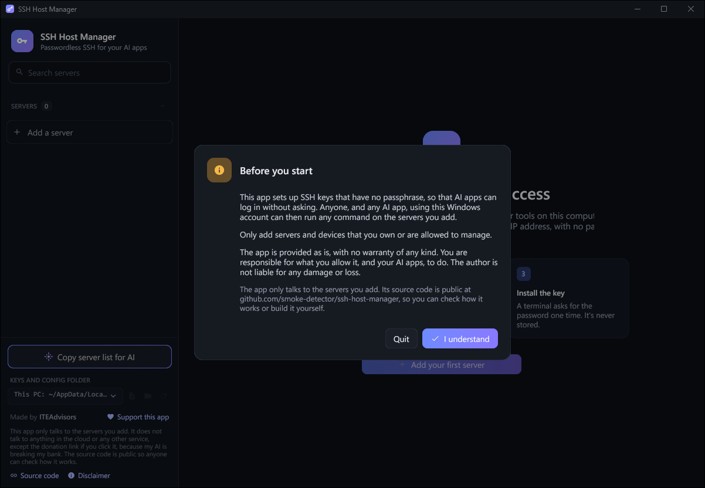
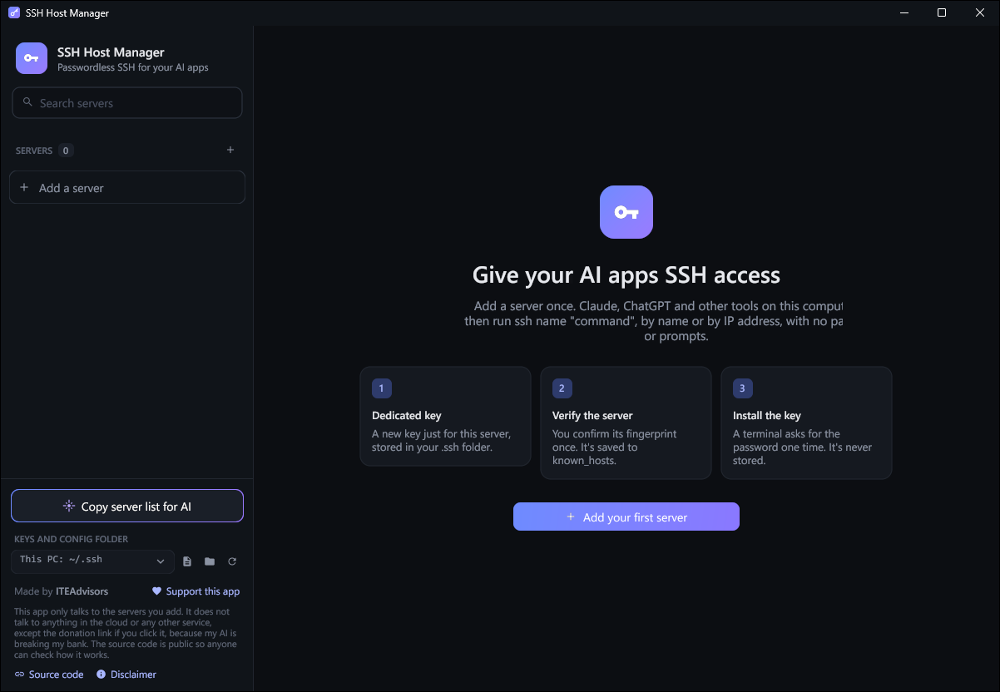
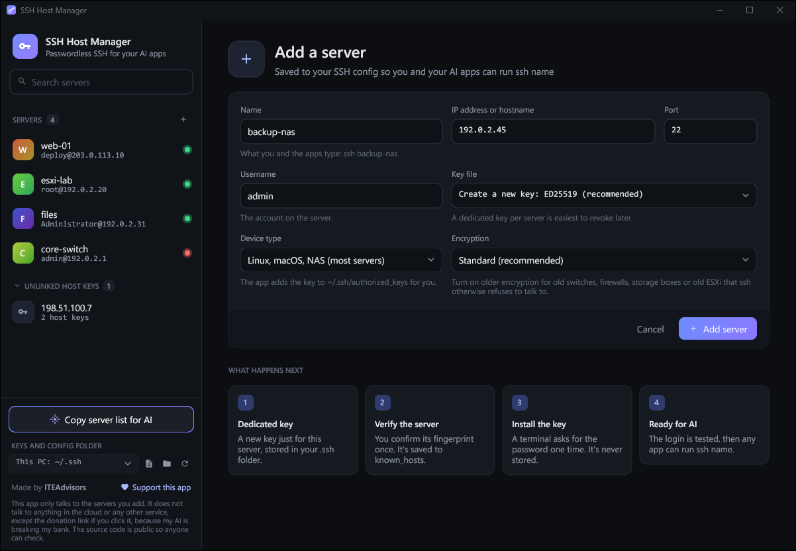
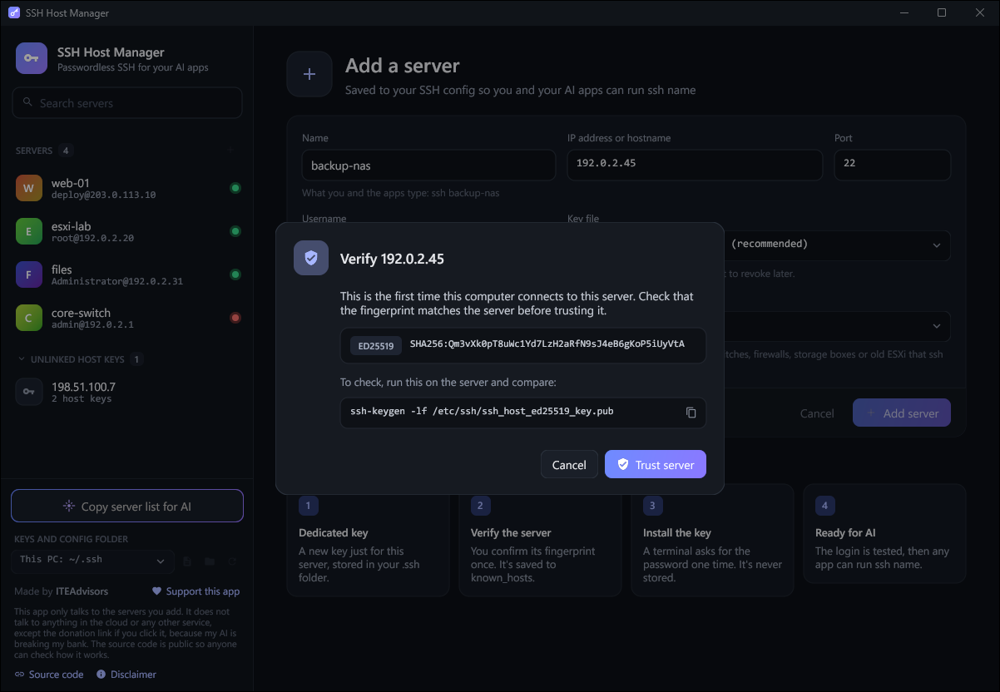
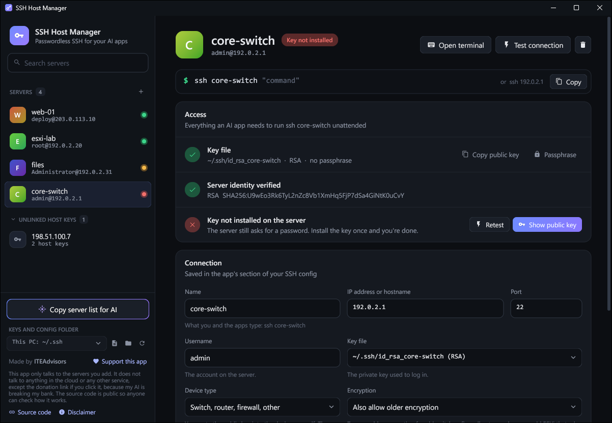
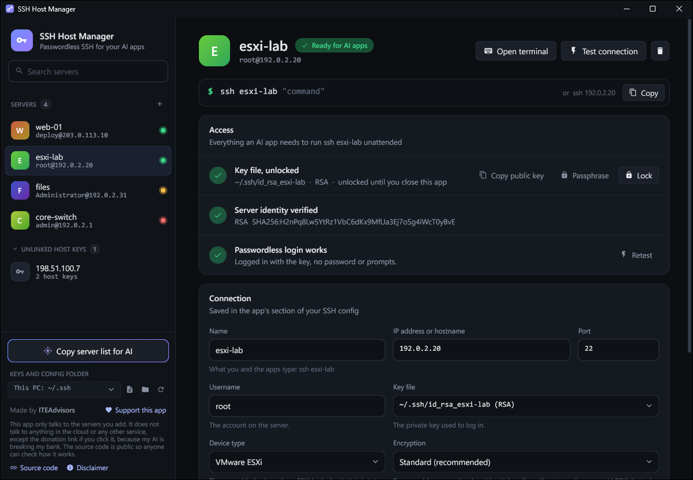
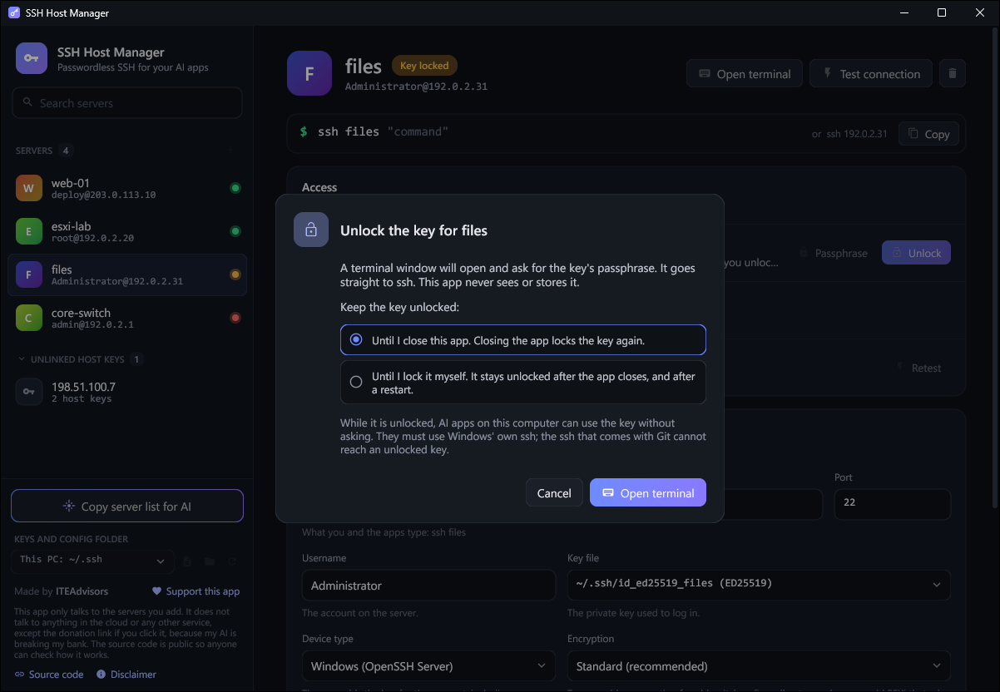

# SSH Host Manager: user manual

SSH Host Manager sets up passwordless SSH from your Windows PC to your servers and
devices. You add a server once. After that, you and any AI app that can run a command on
your PC (Claude, ChatGPT desktop tools, scripts) can run:

    ssh web-01 "uptime"

with no password and no prompts. The IP address works in place of the name.

> **This app only talks to the servers you add.** It does not talk to anything in the
> cloud or any other service. The source code is free to view so that you can see for
> yourself how the app works and that it is secure, and you can build the app from it
> yourself. The one exception is the donation link, which opens in your browser if you
> click it, because my AI is breaking my bank.

## Contents
1. [What you need](#1-what-you-need)
2. [Start the app](#2-start-the-app)
3. [Add a server](#3-add-a-server)
4. [Device types](#4-device-types)
5. [Use it from an AI app](#5-use-it-from-an-ai-app)
6. [Change or delete a server](#6-change-or-delete-a-server)
7. [Host keys](#7-host-keys)
8. [Where your files are kept](#8-where-your-files-are-kept)
9. [Older devices](#9-older-devices)
10. [Keys with a passphrase](#10-keys-with-a-passphrase)
11. [When something goes wrong](#11-when-something-goes-wrong)
12. [Privacy and security](#12-privacy-and-security)
13. [Build it yourself](#13-build-it-yourself)
14. [Disclaimer](#14-disclaimer)
15. [License](#15-license)
16. [Support the app](#16-support-the-app)

## 1. What you need
- Windows 10 or 11.
- The OpenSSH Client, which is built into Windows. If the app says it is missing, add it
  in **Settings > System > Optional features**.
- The password for the server, one time, to install the key.

The app does not need administrator rights and should not be run as administrator.

## 2. Start the app
Download `SSHHostManager.exe` from the [Releases](https://github.com/smoke-detector/ssh-host-manager/releases/latest) page of this
repository, or build it from the source (see the [README](README.md#build-it-yourself)).
Then run it. There is no installer and nothing else to install. You can keep the file
anywhere, including inside your `.ssh` folder.

The first time it starts, the app shows a short notice and asks you to accept it. Nothing
is contacted before you do. You can read it again later from **Disclaimer** at the
bottom left of the window.

Windows may show "Windows protected your PC" the first time, because the file is not
code-signed. Choose **More info > Run anyway**, or build the app yourself from the
source in this repository.

## 3. Add a server
1. Click **+** next to *Servers* (or press Ctrl+N).
2. Fill in the form and click **Add server**.

   

   | Field | What to enter |
   | --- | --- |
   | Name | A short name with no spaces. This is what you type after `ssh`. |
   | IP address or hostname | The server's address. |
   | Port | 22 unless the server uses another port. |
   | Username | The account on the server. Optional: empty means your Windows user name. |
   | Key file | Leave as "Create a new key". One key per server is easiest to revoke. |
   | Device type | What kind of device it is. See [Device types](#4-device-types). |
   | Encryption | Leave as Standard. See [Older devices](#9-older-devices). |

3. **Check the fingerprint.** The app contacts the server and shows its fingerprint.
   Compare it with the server's own (the window shows the command to run on the server)
   and click **Trust server**.

   

4. **Type the password once.** A terminal window opens and asks for the server
   password. The password goes straight to `ssh`. The app never sees or stores it.
5. The app tests the login. When the server shows **Ready for AI apps**, you are done.

Every step shows what it is doing in a small bar at the bottom of the window. If a step cannot finish,
the app says why, and nothing is lost: the server stays in the list and you can continue
from the **Access** box later.

## 4. Device types
| Device type | How the key gets onto the device | Key the app creates |
| --- | --- | --- |
| Linux, macOS, NAS | The app adds it to `~/.ssh/authorized_keys`. | ED25519 |
| VMware ESXi | The app adds it to `/etc/ssh/keys-<user>/authorized_keys` and saves the ESXi configuration. SSH must be enabled on the host. | RSA |
| Windows (OpenSSH Server) | The app adds it for the account. For administrator accounts it also updates `administrators_authorized_keys`. | ED25519 |
| Switch, router, firewall, other | You paste the public key into the device yourself. Click **Show public key**, copy it, add it in the device's web page or command line, then click **Retest**. | RSA |

ESXi and most network equipment do not accept ED25519 keys, so the app picks RSA for
them. You can change the key type in the **Key file** list.

## 5. Use it from an AI app
Click **Copy server list for AI** and paste the text into the AI app. It tells the AI
which servers exist and how to reach them. After that you can ask in plain words, for
example "check disk space on web-01" or "restart nginx on 203.0.113.10".

This works for AI apps that run commands on this PC. A chat in a web browser cannot use
your keys.

## 6. Change or delete a server
- **Log in yourself:** click **Open terminal**. A terminal window opens, logged in to
  the server with the same key the AI apps use. It closes when you log out, and stays
  open if the connection fails so that you can read why.
- **Change:** select the server, edit the **Connection** box, click **Save changes**.
- **Test:** click **Test connection** at any time.
- **Edits are used straight away.** If you change something in the Connection box, for
  example the username, and then click **Install key**, **Test connection**, **Verify
  host key** or **Open terminal**, the app saves your change first and uses the new
  value.
- **Delete:** click the bin icon at the top right. You can delete the key file at the
  same time. The public key stays on the server until you remove it there; to fully
  revoke access, delete its line from the server's `authorized_keys`.

Entries in your SSH config that the app did not create appear under *Other config
hosts*. Select one and click **Manage with this app** to bring it under the app.

## 7. Host keys
A host key is the server's identity. `ssh` refuses to connect when it does not match
what you trusted, which protects you from connecting to an impostor.

- **Re-scan** reads the server's current keys and shows what changed.
- The **bin icon next to a key** removes that one key and leaves the others.
- **Remove all** removes every trusted key for that server.
- If a server was rebuilt, the app reports *Host key changed*. Only choose **Replace and
  trust** when you know why it changed.

*Unlinked host keys* are servers that `ssh` has seen before but that have no entry in
your config. Select one and click **Add as server**; only a name is required.

## 8. Where your files are kept
The list at the bottom left chooses the folder for your server list, keys and
`known_hosts`:

- **OneDrive:** `OneDrive\.ssh`. Your servers and keys follow you to other PCs. Your
  private keys are then stored in OneDrive.
- **This PC:** `C:\Users\<you>\.ssh`, the standard place.
- **App folder:** shown when the app itself sits in a `.ssh` folder.
- **Choose another folder…** for anywhere else.

At first start the app uses, in order: the folder you chose before, a `.ssh` folder the
app was placed in, `OneDrive\.ssh` if it exists, then `C:\Users\<you>\.ssh`.

`ssh` only reads `C:\Users\<you>\.ssh\config` by itself. When you use another folder,
the app adds one `Include` line at the top of that file so that `ssh <name>` keeps
working everywhere. Servers saved in the previous folder stay there and are not moved.

The app only rewrites its own marked sections of the config and keeps a `config.bak`
copy before every change.

## 9. Older devices
Old switches, firewalls, storage boxes and old ESXi versions use encryption that `ssh`
turns off by default. When a login fails for that reason the app says so and offers
**Allow and retry**. You can also set **Encryption** to *Also allow older encryption*
yourself. The setting applies to that one server only, and the server gets an RSA key.

Older encryption is weaker. It lowers the security of the connection to that device, so
use it only where the device offers nothing better.

## 10. Keys with a passphrase
The keys the app creates have no passphrase, so that AI apps can use them at any time.
If you would rather protect a key, you can give it a passphrase. The key is then
**locked** until you unlock it, and you decide for how long it stays unlocked.

The **Key file** line in the *Access* box shows the state as soon as you open the app:

| It says | Meaning |
| --- | --- |
| no passphrase | Anyone using your Windows account can use the key at any time. |
| Key is locked | The key has a passphrase. AI apps and `ssh` can't use it until you unlock it. |
| Key file, unlocked | The key has a passphrase and is unlocked, until you close the app or until you lock it. |

- **Passphrase** adds, changes or removes the passphrase. A terminal window opens and
  `ssh-keygen` asks for it. Leave the new passphrase empty to remove it.
- **Unlock** opens a terminal window where you type the passphrase, and asks how long the
  key should stay unlocked. The app remembers your last choice.
  - *Until I close this app:* closing the app locks the key again. The app tells you so
    before it closes.
  - *Until I lock it myself:* the key stays unlocked after the app closes, and after a
    restart of the computer.
- **Lock** locks the key straight away. No passphrase is needed for that.

Things to know:

- **The app never sees your passphrase.** You type it into `ssh`'s own terminal window.
  The app does not ask for it, remember it or store it.
- **An unlocked key is held by Windows.** The OpenSSH Authentication Agent, a service
  that is part of Windows, keeps the unlocked key, protected for your Windows account,
  until it is locked again. This app does not hold it.
- **The agent is switched off on most computers.** The first time you unlock a key the
  app offers to turn it on. Windows asks for administrator permission, once.
- **AI apps must use Windows' own `ssh`.** The `ssh` that comes with Git cannot reach
  an unlocked key. **Copy server list for AI** tells the AI which one to use.
- **If the app or the computer stops unexpectedly,** keys that were unlocked "until I
  close this app" are locked the next time the app starts.
- **A forgotten passphrase cannot be recovered.** Create a new key for the server in
  the **Key file** list and install it again.

## 11. When something goes wrong
| Message | What it means | What to do |
| --- | --- | --- |
| Couldn't reach … | No answer on that address and port. | Check the address, that the device is on, that SSH is enabled, and that your VPN is connected. Then click **Try again** or **Verify host key**. |
| Key not installed | The server still asks for a password. | Click **Install key** and type the password in the terminal window. |
| Host key rejected / changed | The server's identity is not trusted or is different. | Click **Verify host key** and compare the fingerprint. |
| Needs older encryption | The device is too old for the defaults. | Click **Allow older encryption**. |
| Key locked | The key has a passphrase and is not unlocked. | Click **Unlock** and type the passphrase in the terminal window. See [Keys with a passphrase](#10-keys-with-a-passphrase). |
| Key file is missing | The key file was moved or deleted. | Click **Create key**, then install it again. |
| ssh can't see this folder yet | The `Include` line could not be written. | Check that `C:\Users\<you>\.ssh\config` is not read-only. |

## 12. Privacy and security
**What the app connects to.** Only the servers you add, on the port you set, using
the `ssh`, `ssh-keygen` and `ssh-keyscan` programs that come with Windows. It has no
accounts, no analytics, no update checks and no cloud service. The source code is
public so that anyone can check this.

**No browser inside.** The window is drawn by the app itself. There is no web view or
embedded web page, and no web client is built into the program.

**The donation link** is the one exception to "talks to nothing else", because my AI is
breaking my bank. It opens in your own web browser, and only when you click it. The app
itself does not contact the payment site.

**Check it yourself.** Open Resource Monitor (search for it in the Start menu), go to
the **Network** tab and tick `SSHHostManager.exe` and `ssh.exe`. The only addresses you
will see are the servers in your list. You can also read the source code and
[build the app yourself](#13-build-it-yourself).

**Two things happen outside the app.** If you enter a hostname instead of an IP
address, Windows looks the name up through your usual DNS server, as it does for any
program. If you choose the OneDrive folder, OneDrive, not this app, syncs the files.

**Passwords and passphrases** are typed into `ssh`'s own terminal window. The app never
receives them and has nothing to remember or store.

**Keys have no passphrase by default** so that AI apps can use them unattended. Anyone
who can use your Windows account can use them. You can add a passphrase and unlock the
key only when you want it used: see [Keys with a passphrase](#10-keys-with-a-passphrase). Each server gets its own key so that you can revoke
one without touching the others.

**No administrator rights.** Everything the app changes is inside your own user profile
or the folder you chose.

## 13. Build it yourself
The source code is public so that you can see how the app works, and so that you do not
have to trust a ready-made file. Building it takes a few minutes. The license lets you
compile the code as it is; it does not allow changing or reusing it.

1. Install Go 1.26 or newer from https://go.dev/dl. No C compiler is needed.
2. Get the source: on the repository page choose **Code > Download ZIP** and unzip it,
   or run `git clone https://github.com/smoke-detector/ssh-host-manager`.
3. Open a terminal in that folder and run:

       go build -trimpath -ldflags "-H windowsgui -s -w" -o SSHHostManager.exe .

4. Run the `SSHHostManager.exe` that appears in the folder.

The first build downloads the drawing toolkit ([Gio](https://gioui.org)) and Go's
support libraries. Their versions are pinned in `go.mod` and their checksums in `go.sum`,
so you get exactly the code this repository was tested with.

The README lists what each source file does and how to check what went into the file
you built.

## 14. Disclaimer
- **No warranty.** The app is provided as is, with no warranty of any kind. The author
  is not liable for any damage or loss from using it.
- **You are responsible for what you allow.** The keys have no passphrase so that AI
  apps can log in without asking. Anyone, and any AI app, using your Windows account can
  then run any command on the servers you add, including destructive ones.
- **Authorized systems only.** Only add servers and devices that you own or are allowed
  to manage.
- **Older encryption is weaker.** Allowing it for a device lowers the security of the
  connection to that device. Use it only where the device offers nothing better.
- **Donations are voluntary.** A donation is a gift, not a purchase, and comes with no
  support or service obligation.
- **Not affiliated.** This app is not affiliated with or endorsed by Anthropic, OpenAI,
  Microsoft, VMware or any other company named here. Their names are trademarks of
  their owners.

## 15. License
The source code is free to view, not free to reuse. In short:

- You may read the code, and compile it unchanged to run the app yourself.
- You may use the app free of charge, personally or inside your organization.
- You may not modify the code, use any of it in other software, or redistribute the
  code or the app.

The exact terms are in the [LICENSE](LICENSE) file. This is not an open-source license. For
anything it does not allow, ask ITEAdvisors first.

## 16. Support the app
SSH Host Manager is made by ITEAdvisors and is free. If it saves you time, you can
[make a donation](https://donate.stripe.com/eVq6oz0LU7ucgX19KE57W00).
