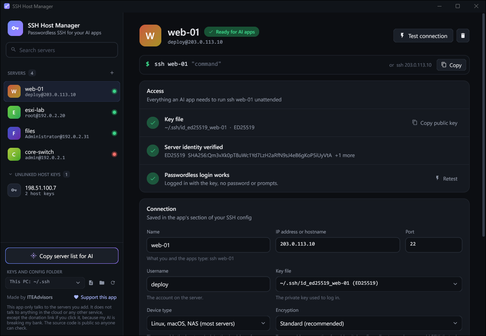

# SSH Host Manager

A small Windows app that sets up passwordless SSH to your servers and devices, so that
you and AI apps (Claude, ChatGPT, anything that can run a shell command) can run
`ssh <name> "<command>"` with no passwords or prompts. The server's address works in
place of the name: `ssh 203.0.113.10 "<command>"`.

> **This app only talks to the servers you add.** It does not talk to anything in the
> cloud or any other service. The source code is free to view so that you can see for
> yourself how the app works and that it is secure, and you can build the app from it
> yourself. The one exception is the donation link, which opens in your browser if you
> click it, because my AI is breaking my bank.

Made by ITEAdvisors. Free to use; the code is free to view but not to reuse (see [License](#license)). [Donate](https://donate.stripe.com/eVq6oz0LU7ucgX19KE57W00) if it helps you.

**[Read the manual](MANUAL.md)**

## What it does
- Creates a dedicated key for each server and installs it after you type the password once.
- Works with Linux, macOS, NAS, VMware ESXi, Windows OpenSSH Server, and network devices.
- Verifies each server's fingerprint before trusting it, and lets you remove host keys
  one at a time.
- Keeps everything in standard OpenSSH files (`config`, `known_hosts`, key files), in
  `~/.ssh`, OneDrive, or a folder you pick.
- Can allow older encryption for one legacy device without weakening the others.

## How you can check the privacy claim
- The window is drawn by the app itself. There is no browser, web view or embedded
  web page, and no HTTP client is compiled into the program.
- The only network code is in `tools.go`: a TCP check of the address you entered, and
  the `ssh`, `ssh-keygen` and `ssh-keyscan` programs that come with Windows.
- The only web addresses in the source are the donation link and this repository's
  address, both in `about.go`. They are handed to your default browser when you click
  them; the app never contacts them.
- Watch it yourself: open Resource Monitor, go to the Network tab, and tick
  `SSHHostManager.exe` and `ssh.exe`. You will only see the servers you added.
- Build it yourself (below), so that what you run is exactly what you read.

Two things happen outside the app. If you enter a hostname instead of an IP
address, Windows looks the name up through your usual DNS server, as it does for any
program. If you choose the OneDrive folder, OneDrive, not this app, syncs the files.

## What it manages
- `config`: only the block between the `# >>> SSH Server Manager` markers is
  rewritten. Everything else is kept as-is, and `config.bak` is saved before each write.
  Each server is written as `Host <name> <address>`, so both forms use the key.
- `known_hosts`: host keys are shown, verified by fingerprint before trusting,
  replaced when a server changes, and cleaned up when a server is deleted or moved.
- Per-server keys (`id_ed25519_<name>` or `id_rsa_<name>`), no passphrase so apps can
  use them unattended.

When the app works in a folder other than `%USERPROFILE%\.ssh`, it adds a small
`# >>> SSH Server Manager: app folder` block with an `Include` line at the top of
`%USERPROFILE%\.ssh\config`, names the folder's `known_hosts` per server, and restricts
the permissions of the config and keys it writes there (ssh refuses them otherwise).
The folder choice is remembered in `%LOCALAPPDATA%\SSHHostManager\settings.json`.

## Build it yourself
The [license](#license) lets you compile the code, unchanged, to run the app yourself.

1. Install Go 1.26 or newer from https://go.dev/dl. No C compiler is needed.
2. Get the source: on the repository page choose **Code > Download ZIP** and unzip it,
   or run `git clone https://github.com/smoke-detector/ssh-host-manager`.
3. Open a terminal in that folder and run:

       go build -trimpath -ldflags "-H windowsgui -s -w" -o SSHHostManager.exe .

4. Run the `SSHHostManager.exe` that appears in the folder.

The first build downloads the drawing toolkit ([Gio](https://gioui.org)) and Go's
support libraries. Their versions are pinned in `go.mod` and their checksums in `go.sum`,
so you get exactly the code this repository was tested with.

To check what went into the file you built:

    go version -m SSHHostManager.exe      # lists every library inside the exe
    go list -deps . | findstr net/http    # prints nothing: no web client is included

The icon and version details are in `rsrc_windows_amd64.syso`, which is included. Only
if you change `winres/winres.json` or the icons do you need to regenerate it:

    go run github.com/tc-hib/go-winres@latest make --in winres/winres.json --arch amd64

| File | What is in it |
| --- | --- |
| `app.go` | Saving, deleting, scanning and trusting servers |
| `tools.go` | Running `ssh`, `ssh-keygen`, `ssh-keyscan`; the key-install commands |
| `sshconfig.go`, `knownhosts.go` | Reading and writing the OpenSSH files |
| `folders.go` | Which folder the app works in |
| `ui.go`, `ui_kit.go`, `ui_flows.go` | The window, its controls, and what the buttons do |
| `exec_windows.go` | Terminal window, folder chooser, file permissions |

For testing, set `SSHKEYS_SSH_DIR` to an empty folder and the app treats it as `~/.ssh`
instead of the real one. `SSHKEYS_ONEDRIVE_DIR` and `SSHKEYS_DATA_DIR` do the same for
OneDrive and for the app's settings folder.

Runtime requirements: Windows 10 or 11 with the OpenSSH Client (built in).

## License
The source code is free to view, not free to reuse. In short:

- You may read the code, and compile it unchanged to run the app yourself.
- You may use the app free of charge, personally or inside your organization.
- You may not modify the code, use any of it in other software, or redistribute the
  code or the app.

The exact terms are in [LICENSE](LICENSE). This is not an open-source license. For
anything it does not allow, ask ITEAdvisors first.

## Disclaimer
- **No warranty.** The app is provided as is, with no warranty of any kind. The author
  is not liable for any damage or loss from using it.
- **You are responsible for what you allow.** The keys have no passphrase so that AI
  apps can log in without asking. Anyone, and any AI app, using your Windows account can
  then run any command on the servers you add, including destructive ones.
- **Authorized systems only.** Only add servers and devices that you own or are allowed
  to manage.
- **Older encryption is weaker.** Allowing it for a device lowers the security of the
  connection to that device. Use it only where the device offers nothing better.
- **Donations are voluntary.** A donation is a gift, not a purchase, and comes with no
  support or service obligation.
- **Not affiliated.** This app is not affiliated with or endorsed by Anthropic, OpenAI,
  Microsoft, VMware or any other company named here. Their names are trademarks of
  their owners.

The app shows the first three points when it is first started and asks you to accept
them. You can read them again from **Disclaimer** at the bottom left of the window.
